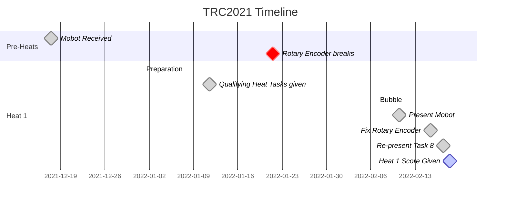

# Line Sensing Robot
DOST-SEI Tagisang Robotics Competition 2.0 2021-2022  
Code for TRC2021 Mobot

## Note From the Future
It's about been two years since I've touched this codebase, and oh boy I got warshocked. It's pretty awful I know, but I was an amateur at the time and under time pressure along with
dealing with a competition. I didn't need to write something good, I just needed to write something fast, accurate, and readable enough.

This repo was supposed to be all organized and such, but after the first Heat (Qualifying Round) I gave up and didn't focus on it as much. You can tell by the fact there
were actually 3 Heats but the Timeline graph below only shows one.

This was a painful journey but it was well worth it. We didn't get the Championship, but we did get 1st Runner Up! That still came with a nice reward of
20k PHP per person in the team. This competition spanned almost the entire school year IIRC. It was loong.

Anyways, that's the end of this note. Goodbye CalNat. Hello UPD 🌻.

---
<!-- 

  <h1>CalNatSci</h1>

 -->
<a href="https://calnatscitechhs.wixsite.com/calnatsci">

   

</a>

  <h3>
    Caloocan National Science and Techonology High School
  </h3>

  <b>
    E=MC2
  </b>
    
  <blockquote>
    E=MC2, Excellence is equal to Motivated, Committed and Competent Individuals
  </blockquote>

  
## Required Libraries:
- Adafruit APDS9960 Library
- Adafruit GFX Library
- Adafruit NeoPixel
- Adafruit SSD1306
- QTRSensors
- Servo
- TimerOne

**Download the dependencies of these libraries as well**

## Timeline

**Note: This timeline is incomplete and only spans the first few months or so. There is a 2nd and 3rd Heat, along with the Semi-Finals and Finals. I was not able to document the events
after the 1st Heat due to time. (The competition spanned nearly an entire year, along with having to deal with schoolworks concurrently) Sorry about that!**

**Heat 1 Completed - 475/500**

# Results
1st Runner Up!
