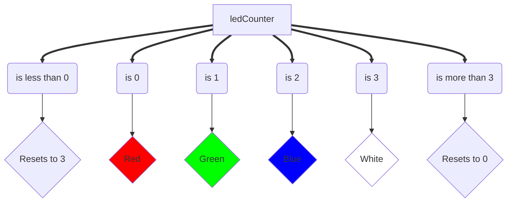

# Task 8

Task 8 is where the LED cycles color depending on the rotation  of the rotary encoder.

## High-Level Concept

To start, we first declare an integer and assigning `0` to it. We must do it outside the function body to prevent reassignment.
```cpp
int ledCounter = 0;

void taskEight() {
  // ...
}
```

Then we create an enum and make it have 2 values, representing the 2 directions the rotary encoder can rotate.
```cpp
enum RotaryDirection { CW, CCW };
RotaryDirection rotaryDirection;
```


This counter holds the current state of the LED. What we want is the LED to change colors whenever we rotate the LED.
For example, when when `ledCounter == 0`, then it shows `Red`. If it is equal to `1`, it displays `Blue` and etc.

### Flow Chart for Clockwise Rotation


**Note that the color would be different for Counter-Clockwise Rotation**

So that's the general idea of the `ledCounter`. Notice it resets to its minimum value when it overflows, and resets to its maximum when it underflows.
This in essence makes the `ledCounter` cycle through numbers 0-3. This is how it's implemented.
```cpp
if (ledCounter < 0) {
  // If less than 0, reset to 3
  ledCounter = 3;
} else if (ledCounter > 3) {
  // If more than 3, reset to 0
  ledCounter = 0;
}
```

It's actually very simple! Just a few if statements. Lets see how this works in a for loop
```cpp
int ledCounter = 0;

for (int i = 0; i > 10; i++) {
  if (ledCounter < 0) {
    // If less than 0, reset to 3
    ledCounter = 3;
  } else if (ledCounter > 3) {
    // If more than 3, reset to 0
    ledCounter = 0;
  }
  
  Serial.println(ledCounter);
}

// Output:
// 0
// 1
// 2
// 3
// 0
// 1
// 2
// 3
// 0
// 1
```

As you can see, it cycles through numbers 0-3, never going under or over them. This is important so we can only
have 4 states maximum. One state for each color.

## Changing `ledCounter` with Rotary Encoder
We won't go into the specifics of how a Rotary Encoder works, but we will discuss as to how it affects `ledCounter`

```cpp
  if (crotState != lrotState && crotState == 0) {
    if (digitalRead(ROTARY_DTP) != crotState) {
      // Rotary Has been turned clockwise
      rotaryVal++;
      rotaryDir = CW;
      
    } else {
      // Rotary has been turned counterclockwise
      rotaryVal--;
      rotaryDir = CCW;
    }

    ledCounter++;
  }
```
You don't have to understand how this works, but for now all you need to know is that the `ledCounter` increments
when the rotary is turned. The direction of the rotary doesn't matter, it still increments either way.

Wait, so how does it know which colors to cycle then? By basing off `rotaryDir`. If it is turning Clockwise, then it cycles a certain color scheme,
while cycling through a different color scheme in Counterclockwise.
```cpp
if (rotaryDir == CW) {
  if (ledCounter == 0) {
    pixels.setPixelColor(0, 255, 0, 0);   // RED
  } else if (ledCounter == 1) {
    pixels.setPixelColor(0, 0, 255, 0);   // GREEN
  } else if (ledCounter == 2) {
    pixels.setPixelColor(0, 0, 0, 255);   // BLUE
  } else if (ledCounter == 3) {
    pixels.setPixelColor(0, 255, 255, 255); // WHITE
  }
} else {
  if (ledCounter == 0) {
    pixels.setPixelColor(0, 255, 0, 0);   // RED
  } else if (ledCounter == 1) {
    pixels.setPixelColor(0, 255, 255, 255); // WHITE
  } else if (ledCounter == 2) {
    pixels.setPixelColor(0, 0, 0, 255);   // BLUE
  } else if (ledCounter == 3) {
    pixels.setPixelColor(0, 0, 255, 0);   // GREEN
  }
}

pixels.show();
```
As you can see the colors are just hardcoded. And that each direction cycles through different colors. CW is RGBW, while CCW is RWBG.  
Then `pixels.show()` is ran to display the color and light.

And that's mostly it, with one finishing touch. When changing directions, it will continue at the state it is in. For example, if `ledCounter`
is equal to 3 and turning CW, then it is turned CCW, it continues on at 3, incrementing into 4. This can make it a bit confusing when
changing directions, because it does not restart at 0 or red when the direction is changed. 

This small touch would reset `ledCounter` to 0, or RED whenever `rotaryDir` changes direction, making it easier to see
when a direction has been changed, or to see a cycle.
```cpp
RotaryDirection lastDir;

void taskEight() {
  // ...

  // If direction chages, reset ledCounter so cycle always restarts with first color (red)
  if (lastDir != rotaryDir) {
    ledCounter = 0;
  }

  lastDir = rotaryDir;

  // ...
}
```

And that's more or less how we cycle the LED with a rotary encoder.
