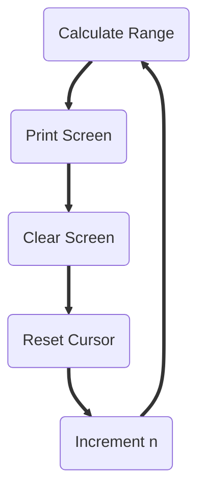

# Task Nine
Task Nine is the scrolling LCD Screen

## LCD Basics
The way the LCD Screen (technically an OLED, but TRC calls it LCD so meh) works is by drawing certain characters on a screen, then displaying it.
Sounds pretty self-explanatory, but in terms of code it kind of isn't.

So let's see How an LCD works with some simple code.
```cpp
void initSsd() {
  ssd.clearDisplay();
  ssd.setCursor(0, 0);
  ssd.setTextSize(1);
  ssd.setTextColor(SSD1306_WHITE);
  ssd.cp437(true);

  Serial.println(">> Lcd screen configuration successful!");
}
```
First we have to initialize our LCD. Let's walkthrough each line and see what they do.  
`ssd.clearDisplay()` - This one justs clears the display since there could still be text from the last time the mobot was run.  
`ssd.setCursor(0, 0)` - This sets the Cursor to the top left of the display.   
`ssd.setTextSize(1)` - This just sets the text size to 1.  
`ssd.setTextColor(SSD1306_WHITE)` - Supposed to set the color to white, but it doesn't seem supported in this LCD  
`ssd.cp437(true)` - Uses a the cp437 character set (because apparently the Adafruit_GFX Lib had a bug which uses the wrong character set,
and many older projects depended on it, so they introduced this if we wanted to use the correct one :/)

What is a cursor though? The cursor is the point of the screen where text will be inserted. Think of it as the blinking white bar when you're typing in your computer.
We have to reset it to the top left every time because calling `ssd.clearDisplay()` does not set it automatically.

### Displaying Text
So thats how we initialize the LCD screen. Now we could display text with it!
```cpp
ssd.println("Hello There");
ssd.println(12345);

// ssd.println() won't display until after ssd.display() has been called
ssd.display();

// LCD screen Output:
// Hello There
// 12345
```

Very simple! And clearing the screen is also simple
```cpp
ssd.clearDisplay();

// Reset cursor to top left of screen
ssd.setCursor(0, 0);
```
We have to make sure the cursor is back at the top left, or it will keep printing where it left off.
We don't want characters to print on the middle of the screen! There is also a possibility that the cursor could 
be longer than the screen itself, meaning the characters would not even be visible anymore! So we have to reset the cursor to prevent that.

## High-Level Overview
Now that we've seen the basics of LCD screens, lets see how we can create a scrolling version of it.

My take on this situation was to use a range of values, and that range will be printed on the LCD screen.
Specifically, that range would be `n - 8` to `n`. There are only 8 values within this range, because we can only fit 8 characters in the screen vertically.

So for example, if `n = 5`, then our range would be `5 - 8` to `5`. or `-3` to `5`. We would then print these values on the LCD screen as such:
```cpp
int n = 5;
int nMinusEight = n - 8;

for (int j = nMinusEight; j < n; j++) {
  ssd.println(j);
}

ssd.display();
// Output:
// -3
// -2
// -1
// 0
// 1
// 2
// 3
// 4
```
As you can see, these 8 values are printed into the LCD. What if we change our `n` to 6? Or in other words, increment `n` by one?
```cpp
// Output:
// -2
// -1
// 0
// 1
// 2
// 3
// 4
// 5
```
You'll notice that Output also increments by one as well! What does this mean for us though?  

It means that if we are able to print one range of values, then clear the screen, then print the second range of values, it will effectively look to us as if it
were scrolling! Here's a flow chart to better understand



## Implementation
Thus we could just use a for loop to increment `n` every iteration.

```cpp
 for (int n = 1; n <= 21; n++) {
    ssd.clearDisplay();   // Clears Display after each iteration, allowing for next range of numbers to be printed
    ssd.setCursor(0, 0);  // Resets Cursor to top left,

    int trailingInt = n - 8;  // Calculates last number in the range

    // Loop through the range, and print each number within the range
    for (int j = trailingInt; j < n; j++) {
        ssd.println(j);
    }

    ssd.display(); // Display the range of numbers
    delay(100);   // Slight delay to make scrolling easier to see
  }
```

And done! well mostly. This would also print the negative values as well, but we only need to print positive values. 
This is easy to fix though, we just print every negative number as a blank space.
```cpp
for (int j = trailingInt; j < n; j++) {
  if (j <= 0) {
    ssd.println(" "); // Prints a blank space if negative or zero
  } else {
    ssd.println(j); // Prints actual character
  }
}
```

And done! Again! Well not really... Some finishing touches are added
```cpp
void taskNine() {
  for (uint8_t i = 1; i <= 21; i++) {
    ssd.clearDisplay();
    ssd.setCursor(0, 0);
    int8_t trailingInt = i - 8;

    for (int8_t j = trailingInt; j < i; j++) {
      if (j <= 0) {
        ssd.println(" ");
      } else {
        ssd.println(j);
      }
    }

    ssd.display();
    delay(100);
  }
}
```

And done! Again! For real this time! That is how I created the LCD scrolling task. In the final code, the types have been
changed from `int` to either `int8_t` or `uint8_t`. This is mainly to save space, as these two types are only 1 byte wide. 
I can also use either signed or unsigned integers to be more specific.

That's all for now, bai
